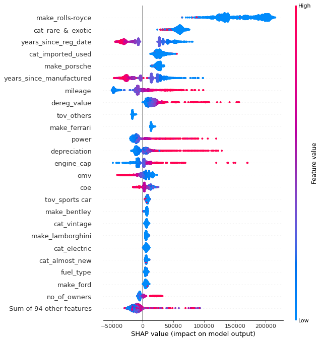

# Carmart Analysis
Perform data analysis on used cars market.

## Project Intro
Given used cars market data, design and apply data mining techniques to come up with appropriate solutions.

### Methods Used
* Machine Learning
* Data Visualization
* Interpretable Machine Learning

### Technologies
* Python
* Pandas, jupyter
* Shapley

## Project Description
1. `Task 1` Prediction of car resale prices. This a regression problem. Important features are identified.
2. `Task 3` Predict the number of days to sell a car. Interpret machine learning models to identify significant features that reduce the duration to sell a car.

## Process Flow
- data scraping
- data exploration
- data processing
- data modeling
- writeup

